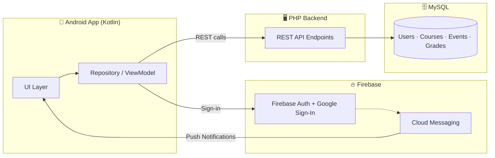

<div align="center">


<a href="https://readme-typing-svg.demolab.com">
  
</a>

<br/><br/>

[](https://github.com/ComradeMohan/192210400PDD/stargazers)
[](https://github.com/ComradeMohan/192210400PDD/network/members)
[](https://github.com/ComradeMohan/192210400PDD/commits/main)
[](https://github.com/ComradeMohan/192210400PDD)

<br/>

[](#)
[](#)
[](#)
[](#)

<br/>

[](https://univault.live)

<p align="center">
  <a href="https://play.google.com/store/apps/details?id=com.simats.univault">
    
  </a>
</p>

<p align="center">
  ⭐ <b>If UniVault is useful to you, consider starring the repo</b> — it genuinely helps.
</p>

 <picture>
       
</picture>

</div>

<br/>

## Table of Contents

- [Overview](#overview)
- [Why UniVault](#why-univault)
- [Features](#features)
- [Tech Stack](#tech-stack)
- [Architecture](#architecture)
- [Screenshots](#screenshots)
- [Project Structure](#project-structure)
- [Getting Started](#getting-started)
  - [Requirements](#requirements)
  - [Backend Setup](#backend-setup-php--mysql)
  - [Frontend Setup](#frontend-setup-kotlin--firebase)
  - [Configuration](#configuration)
- [Usage](#usage)
- [Contributing](#contributing)
- [Support](#support)
- [Author](#author)

<br/>

## Overview

**UniVault** is a full-stack academic management system built for institutions to manage courses, events, grades, and multi-role communication — all in one place.

<table>
<tr>
<td width="33%" align="center"><b>🖥️ Backend</b><br/>PHP + MySQL REST API</td>
<td width="33%" align="center"><b>📱 Frontend</b><br/>Native Android app in Kotlin</td>
<td width="33%" align="center"><b>🔔 Auth & Notifications</b><br/>Firebase (Auth, FCM, Google Sign-In)</td>
</tr>
</table>

<br/>

## Why UniVault

<table>
<tr>
<td width="25%" align="center">
<b>Multi-Role by Design</b><br/><sub>Dedicated flows for Admins, Faculty, and Students — not a single generic dashboard.</sub>
</td>
<td width="25%" align="center">
<b>Real-Time by Default</b><br/><sub>Push notifications via Firebase Cloud Messaging keep everyone in sync instantly.</sub>
</td>
<td width="25%" align="center">
<b>Production-Ready</b><br/><sub>Live on the Google Play Store, not a prototype or class demo.</sub>
</td>
<td width="25%" align="center">
<b>Simple, Proven Stack</b><br/><sub>PHP + MySQL + Kotlin + Firebase — reliable, well-documented, easy to extend.</sub>
</td>
</tr>
</table>

<br/>

## Features

<table>
<tr>
<td width="50%" valign="top">

### 🔐 Authentication
- Role-based login for Admin, Faculty, and Students
- Google Sign-In via Firebase
- Secure password change & reset flows

### 📚 Course Management
- Add, update, and delete courses & departments
- Faculty-to-course assignment

</td>
<td width="50%" valign="top">

### 📅 Events & Notices
- Schedule, update, and remove events/notices
- Real-time push notifications via FCM

### 📊 Grades & Feedback
- Submit and retrieve student grades
- Structured feedback collection

</td>
</tr>
<tr>
<td width="50%" valign="top">

### 🧑‍💼 Multi-Role Dashboards
- Dedicated panels for Admin and Faculty
- Distinct endpoints per role

</td>
<td width="50%" valign="top">

### 📩 Notifications
- Push (FCM), email, and in-app notices
- Keeps students and faculty in sync

</td>
</tr>
</table>

<br/>

## Tech Stack

<div align="center">

</div>

<!-- Place the tech-stack.svg file in an `assets/` folder at the repo root so the path above resolves. -->

<br/>

## Architecture



<br/>

## Screenshots

<div align="center">
<!-- Replace with real screenshots: drag images into an issue/PR to get a hosted URL, or add them to a /screenshots folder and reference here -->

<picture>
  <source media="(prefers-color-scheme: dark)" srcset="./assests/univault_banner_dark.png">
  <source media="(prefers-color-scheme: light)" srcset="./assests/univault_banner.png">
  
</picture>

</div>

<br/>

## Project Structure

```
192210400PDD/
├── assets/            # Static images used in this README (e.g. tech-stack.svg)
├── backend/           # PHP backend scripts & API endpoints
│   └── *.sql            # Database schema files
├── frontend/          # Kotlin Android app
└── README.md
```

| Path | Description |
|---|---|
| [`backend/`](https://github.com/ComradeMohan/192210400PDD/tree/main/backend) | PHP backend scripts and API endpoints |
| `frontend/` | Kotlin Android app (or linked repo) |
| MySQL | Persistent storage |
| Firebase | Push notifications & authentication |

<br/>

## Getting Started

### Requirements

- PHP 7.4+ and a MySQL instance
- Android Studio (latest stable)
- A Firebase project with Auth, Firestore, and FCM enabled

### Backend Setup (PHP + MySQL)

```bash
git clone https://github.com/ComradeMohan/192210400PDD.git
```

1. Set up your PHP server and MySQL instance.
2. Import the database schema (`.sql` files under `backend/`).
3. Configure the database connection in `backend/db.php`.
4. Install any dependencies (see `vendor/`).

### Frontend Setup (Kotlin + Firebase)

1. Open `frontend/` (or your Android project) in Android Studio.
2. Link your Firebase project and drop `google-services.json` into the app module.
3. Enable Firebase Auth, Firestore, and FCM for the project.

### Configuration

| File | Purpose |
|---|---|
| `backend/db.php` | Database connection credentials |
| `google-services.json` | Firebase project configuration for the Android app |

<br/>

## Usage

- Backend endpoints handle all management operations.
- The Android app talks to the backend via REST APIs and to Firebase directly for auth/notifications.
- **Admins** manage users, courses, and events. **Faculty** manage courses and student data. **Students** interact with notices, events, and grades.

<br/>

## Contributing

Contributions are welcome and appreciated.

1. Fork this repository
2. Create a feature branch — `git checkout -b feature-name`
3. Commit your changes
4. Push to your branch and open a Pull Request

[](https://github.com/ComradeMohan/192210400PDD/pulls)

<br/>

## Support

If you run into an issue or have a feature request, please [open an issue](https://github.com/ComradeMohan/192210400PDD/issues) on this repository.

<br/>

## Author

<div align="center">

**Comrade Mohan** — Founder & Developer

[](https://github.com/ComradeMohan)
[](https://linkedin.com/in/mmohanreddy)
[](https://mohanreddy.me)


</div>
