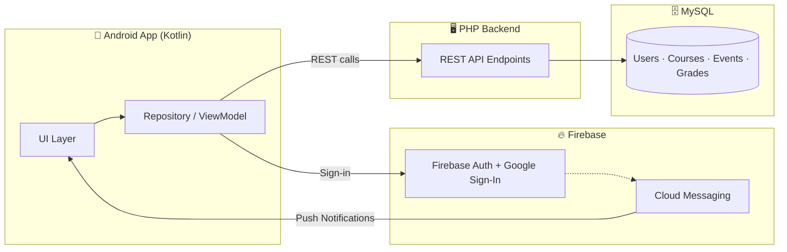
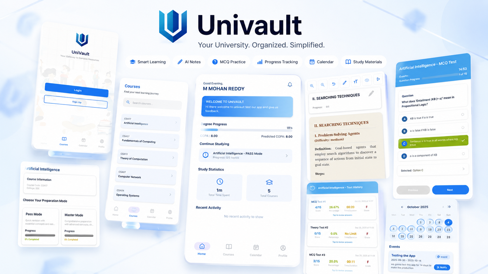

<div align="center">


<a href="https://readme-typing-svg.demolab.com">
  
</a>

<br/>

[](https://github.com/ComradeMohan/192210400PDD/stargazers)
[](https://github.com/ComradeMohan/192210400PDD/network/members)
[](https://github.com/ComradeMohan/192210400PDD/commits/main)
[](https://github.com/ComradeMohan/192210400PDD)

[](#)
[](#)
[](#)
[](#)

[](https://univault.live)

<p align="center">
  <a href="https://play.google.com/store/apps/details?id=com.simats.univault">
    
  </a>
</p>

</div>

<p align="center">
  <b>Star this repo</b> if UniVault is useful to you — it genuinely helps 🌟
</p>

---

## 📋 Table of Contents

- [Overview](#-overview)
- [Features](#-features)
- [Tech Stack](#-tech-stack)
- [Architecture](#-architecture)
- [Screenshots](#-screenshots)
- [Project Structure](#-project-structure)
- [Getting Started](#-getting-started)
- [Usage](#-usage)
- [Contributing](#-contributing)
- [Author](#-author)

---

## 🧭 Overview

**UniVault** is a full-stack academic management system built for institutions to manage courses, events, grades, and multi-role communication — all in one place.

- 🖥️ **Backend:** PHP + MySQL REST API
- 📱 **Frontend:** Native Android app in Kotlin
- 🔔 **Auth & Notifications:** Firebase (Auth, FCM, Google Sign-In)

---

## ✨ Features

<table>
<tr>
<td width="50%">

**🔐 Authentication**
- Role-based login for Admin, Faculty, and Students
- Google Sign-In via Firebase
- Secure password change & reset flows

**📚 Course Management**
- Add, update, and delete courses & departments
- Faculty-to-course assignment

</td>
<td width="50%">

**📅 Events & Notices**
- Schedule, update, and remove events/notices
- Real-time push notifications via FCM

**📊 Grades & Feedback**
- Submit and retrieve student grades
- Structured feedback collection

</td>
</tr>
<tr>
<td width="50%">

**🧑‍💼 Multi-Role Dashboards**
- Dedicated panels for Admin and Faculty
- Distinct endpoints per role

</td>
<td width="50%">

**📩 Notifications**
- Push (FCM), email, and in-app notices
- Keeps students and faculty in sync

</td>
</tr>
</table>

---

## 🛠 Tech Stack

<div align="center">

</div>

<!-- Place the tech-stack.svg file in an `assets/` folder at the repo root so the path above resolves. -->
<!--
| Backend | Database | Frontend | Notifications/Auth |
|---------|----------|----------|-------------------|
|  |  |  |  |
-->
---

## 🏗 Architecture



---

## 📸 Screenshots

<div align="center">
<!-- Replace with real screenshots: drag images into an issue/PR to get a hosted URL, or add them to a /screenshots folder and reference here -->

</div>

---

## 📁 Project Structure

```
192210400PDD/
├── assets/            # Static images used in this README (e.g. tech-stack.svg)
├── backend/           # PHP backend scripts & API endpoints
│   └── *.sql            # Database schema files
├── frontend/          # Kotlin Android app
└── README.md
```

- [`backend/`](https://github.com/ComradeMohan/192210400PDD/tree/main/backend) — PHP backend scripts and API endpoints
- `frontend/` — Kotlin Android app (or linked repo)
- MySQL — persistent storage
- Firebase — push notifications & authentication

---

## 🚀 Getting Started

### Backend (PHP + MySQL)

```bash
git clone https://github.com/ComradeMohan/192210400PDD.git
```

1. Set up your PHP server and MySQL instance.
2. Import the database schema (`.sql` files under `backend/`).
3. Configure the database connection in `backend/db.php`.
4. Install any dependencies (see `vendor/`).

### Frontend (Kotlin + Firebase)

1. Open `frontend/` (or your Android project) in Android Studio.
2. Link your Firebase project and drop `google-services.json` into the app module.
3. Enable Firebase Auth, Firestore, and FCM for the project.

---

## 💡 Usage

- Backend endpoints handle all management operations.
- The Android app talks to the backend via REST APIs and to Firebase directly for auth/notifications.
- **Admins** manage users, courses, and events. **Faculty** manage courses and student data. **Students** interact with notices, events, and grades.

---

## 🤝 Contributing

1. Fork this repository
2. Create a feature branch — `git checkout -b feature-name`
3. Commit your changes
4. Push to your branch and open a Pull Request

[](https://github.com/ComradeMohan/192210400PDD/pulls)

---


<!--
## ⭐ Star History
<a href="https://star-history.com/#ComradeMohan/192210400PDD&Date">
  
</a> -->

---

## 👤 Author

<div align="center">

**Comrade Mohan** — Founder & Developer

[](https://github.com/ComradeMohan)
[](https://linkedin.com/in/mmohanreddy)
[](https://mohanreddy.me)


</div>
